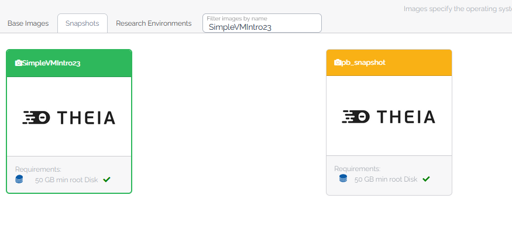
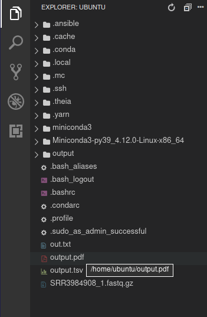

## Part 2: Scale up your analysis

In the first part you have tested the SimpleVM environment. Now it is time
for using a VM with more cores to scale up the analysis. For this reason you 
saved your installed tools by creating a snapshot. You will now reuse
this snapshot with a larger flavor.
Further, we will search for more metagenomic datasets via object storage
and scale up our analysis by providing more cores to mash.

### 2.1 Create a snapshot and a new VM

1. Navigate to the `New Instance` tab (and select the SimpleVMRMU project).

2. Create a VM based on your snapshot with the **de.NBI small** flavor
   which has more cores. Click on the Snapshot tab to select your snapshot.
   

3. Please create a volume for your VM and as set your 
   initial letters (Example: Max Mustermann -> mm) as volume name. 
   Use `/vol/data` as mountpath and provide 1 GB as the storage size.

### 2.2 Interact with the SRA Mirror and search for more datasets to analyse

1. Click on `Terminal` in the upper menu and select `New Terminal`.

2. Unfortunately, conda does not offer a minio cli binary,
   which means that we would have to install it manually.
   Download the binary:
   ```
   wget https://dl.min.io/client/mc/release/linux-amd64/mc
   ```
   Move it to a folder where other binaries usually are stored:
   ```
   sudo mv mc /usr/local/bin/
   ```
   Change file permissions:
   ```
   chmod a+x /usr/local/bin/mc
   ```

3. Add S3 config for our public SRA mirror on our Bielefeld Cloud site:
   ```
   mc config host add sra https://openstack.cebitec.uni-bielefeld.de:8080 "" ""
   ```

4. List which files are available for SRA number `SRR3984908`:
   ```
   mc ls sra/ftp.era.ebi.ac.uk/vol1/fastq/SRR398/008/SRR3984908
   ```

5. Check the size of these files
   ```
   mc du sra/ftp.era.ebi.ac.uk/vol1/fastq/SRR398/008/SRR3984908
   ```

6. You can read the first lines of these files by using `mc cat`.
   ```
   mc cat sra/ftp.era.ebi.ac.uk/vol1/fastq/SRR398/008/SRR3984908/SRR3984908_1.fastq.gz | zcat | head
   ```

7. Search for SRA run accessions we want to analyse and check their size.
   ```
   mc find --regex "SRR6439511.*|SRR6439513.*|ERR3277263.*|ERR929737.*|ERR929724.*"  sra/ftp.era.ebi.ac.uk/vol1/fastq  -exec "  mc ls -r --json  {} " \
      |  jq -s 'map(.size) | add'  \
      | numfmt --to=iec-i --suffix=B --padding=7
   ```

### 2.3 Run commands with more cores and plot your result

1. We created a mash index out of selected genomes that were classified as  
   "greatest threat to human health" by the World Health Organisation (WHO)
   in 2017: https://www.who.int/news/item/27-02-2017-who-publishes-list-of-bacteria-for-which-new-antibiotics-are-urgently-needed 
   Please download the index:
   ```
   wget https://openstack.cebitec.uni-bielefeld.de:8080/simplevm-workshop/genomes.msh
   ```

2. You can now run the commands from the first part with found datasets as input:
   ```
   for f in $(mc find --regex "SRR6439511.*|SRR6439513.*|ERR3277263.*|ERR929737.*|ERR929724.*" sra/ftp.era.ebi.ac.uk/vol1/fastq  ); do 
       sra_id=$(echo $f | rev | cut -d '/' -f 1 | rev | cut -d '_' -f 1 | cut -d '.' -f 1);
       mc cat $f | mash screen -p 8 genomes.msh -  \
           | sed "s/^/${sra_id}\t/g"  \
           | sed 's/\//\t/' ;
   done | tee output.tsv
   ```

3. Let's plot how many genomes we have found against the number of their matched k-mer hashes:
   ```
   csvtk -t plot hist -H -f 3 output.tsv -o output.pdf
   ```
   You can open this file by a click on the Explorer View and selecting the pdf. 
   

4. Get the title and the environment name about the found datasets by using Entrez tools
   ```
   while read sraid; do  
     esearch -db sra -query ${sraid} \
       | esummary \
       | xtract -pattern DocumentSummary -element @ScientificName,Title \
       | sort | uniq  \
       | sed "s/^/${sraid}\t/g"; 
   done < <(cut -f 1 output.tsv | sort | uniq) > publications.tsv
   ```

5. Set correct permissions on your volume:
   ```
   sudo chown ubuntu:ubuntu /vol/data/
   ```

6. Copy your results to the volume for later use:
   ```
   cp publications.tsv output.tsv /vol/data
   ```

7. Go to the Instance Overview page. Click on actions and detach the volume.
   

8. Finally, you can delete the VM.

Continue with [Part 3](part3.md)
