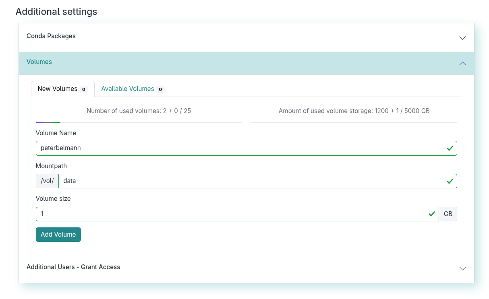
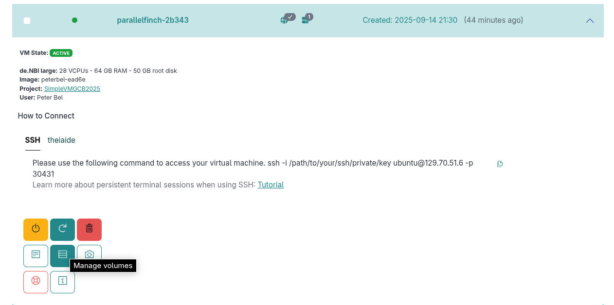
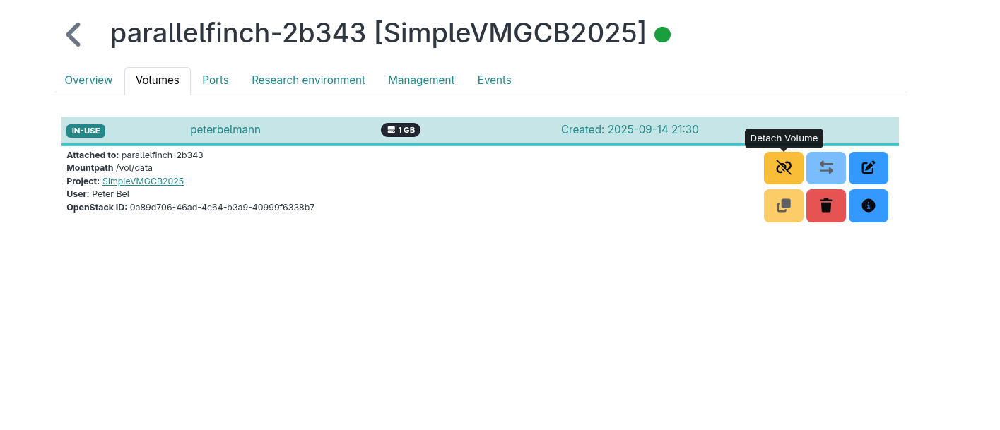

## Section 3: Scale up your analysis vertically

In Parts 1 and 2, you tested the SimpleVM environment and the tools required for our analysis.
Now it is time to use a VM with more cores to scale up the analysis vertically. 

In the previous part, you saved your installed tools by creating a snapshot.
If the snapshot upload has not been completed, we have prepared a snapshot for you. You will now reuse this snapshot with a larger flavour.
Next, we will search for more metagenomic datasets via object storage and scale up our analysis by allocating more cores.

### 3.1 Create a new VM based on your snapshot

1. Click on **Snapshots** in left menu and check which status
   your snapshot has. You can also filter of the name in the top menu. 
   If it has the status `active`, you can click on the snapshot to open the dropdown menu and click on start to spawn a new VM.
   In case your snapshot is still not active just choose the **SimpleVMGCB** snapshot. You will now be redirected to the **Create new Instance** page with a
   preselected snapshot.
   

2. Provide again a name for your instance.

3. In the flavors sections please choose the **de.NBI large** flavor which has 28 cores available.
   

4. Please create a volume for your VM and enter your name without whitespace 
   (Example: Max Mustermann -> MaxMusterman) as the volume name. 
   Enter `data` (`/vol/data`) as mountpath and provide 1 GB as the storage size.
   Don't forget to click on `Add Volume`. 
   

5. Grant again access to all project members with a `Cloud-portal-support` tag.
   This way these members get ssh access to your VM and can help you in case
   something does not work as expected.
   

6. Confirm the checkbox and click on **Start Instance**.
   

### 3.2 Interact with the SRA Mirror and search for more datasets to analyze

1. You are now on the **Instances** page. You can delete your old VM which is stopped and
   we used to create your snapshot. To do this, open the dropdown of the old machine again
   and select **Delete**. Confirm the deletion of the machine.
   
   
2. On your new VM, select again the link to access Theia IDE.
   

3. Click on `Terminal` in the upper menu and select `New Terminal`.
   

4. Activate the conda environment by running:
   ```
   conda activate denbi
   ```

6. Add S3 config for our public SRA mirror on our Bielefeld Cloud site:
   ```
   mc alias set sra https://openstack.cebitec.uni-bielefeld.de:8080 "" ""
   ```

7. List which files are available for SRA number `SRR3984908`:
   ```
   mc ls sra/ftp.era.ebi.ac.uk/vol1/fastq/SRR398/008/SRR3984908
   ```

8. Check the size of these files
   ```
   mc du sra/ftp.era.ebi.ac.uk/vol1/fastq/SRR398/008/SRR3984908
   ```

9. You can read the first lines of these files by using `mc cat`.
   ```
   mc cat sra/ftp.era.ebi.ac.uk/vol1/fastq/SRR398/008/SRR3984908/SRR3984908_1.fastq.gz | zcat | head
   ```

10. Search for SRA run accessions we want to analyse and check the sum of their size
   (this may take a while to complete):
   ```
   mc find --regex "SRR6439511.*|SRR6439513.*|ERR3277263.*|ERR929737.*|ERR929724.*"  sra/ftp.era.ebi.ac.uk/vol1/fastq  -exec "  mc ls -r --json  {} " \
      |  jq -s 'map(.size) | add'  \
      | numfmt --to=iec-i --suffix=B --padding=7
   ```

   <details><summary>Show Explanation</summary>
      
    * `mc find` reports all files that have one of the following prefixes in their file name: `SRR6439511.`, `SRR6439513.`, `ERR3277263.`, `ERR929737.`, `ERR929724.`.
    *  `jq` uses the json that is produced by `mc find` and sums up the size of all files (`.size` field).
    * `numfmt` transforms the sum to a human-readable string.
   
   </details>

### 3.3 Run commands with more cores and plot your result

1. We created a MASH index out of selected genomes that were classified as  
   "greatest threat to human health" by the World Health Organisation (WHO)
   in 2017: https://www.who.int/news/item/27-02-2017-who-publishes-list-of-bacteria-for-which-new-antibiotics-are-urgently-needed 
   Please download the index:
   ```
   wget https://openstack.cebitec.uni-bielefeld.de:8080/simplevm-workshop/genomes.msh
   ```

2. We created a file that points to the datasets that you have found in the previous chapter.
   Download the input file via:
   ```
   wget https://openstack.cebitec.uni-bielefeld.de:8080/simplevm-workshop/reads.tsv
   ```
   You can inspect the file by using `cat`:
   ```
   cat reads.tsv
   ```
3. We will create a directory for the output for the following command. We will place an output
   file for every SRA ID.
   ```
   mkdir -p output
   ```

4. You can now run the commands from the first part with found datasets as input (this may take a while to complete):
   Create a function that we will run in prallel:
   ```
   search(){ 
      left_read=$(echo $1 | cut -d ' '  -f 1);  
      right_read=$(echo $1 | cut -d ' ' -f 2); 
      sra_id=$(echo ${left_read} | rev | cut -d '/' -f 1 | rev | cut -d '_' -f 1 | cut -d '.' -f 1);
      mc cat $left_read $right_read | mash screen -p 3 genomes.msh - \
          | sed "s/^/${sra_id}\t/g"  \
          | sed 's/\//\t/' > output/${sra_id}.txt ;
   }
   ```
   <details><summary>Show Explanation</summary>
   In order to understand what this function does let's take the following datasets as an example:
   <code>
   sra/ftp.era.ebi.ac.uk/vol1/fastq/SRR643/001/SRR6439511/SRR6439511_1.fastq.gz    sra/ftp.era.ebi.ac.uk/vol1/fastq/SRR643/001/SRR6439511/SRR6439511_2.fastq.gz
   </code>
   where
      
    * `left_read` is left file (`sra/ftp.era.ebi.ac.uk/vol1/fastq/SRR643/001/SRR6439511/SRR6439511_1.fastq.gz`)
    * `right_read` is the right file (`sra/ftp.era.ebi.ac.uk/vol1/fastq/SRR643/001/SRR6439511/SRR6439511_2.fastq.gz`)
    * `sra_id` is the prefix of the file name (`SRR6439511`)
    * `mc cat` streams the files into `mash screen` which is using the sketched genomes `genomes.msh`
       to filter the datasets.
    * Both `sed`s are just post-processing the output and place every match in the `output` folder.

   </details>
   
   Export this function, so that we can use it in the next command.
   ```
   export -f search
   ```
   Run your analysis in parallel.
   ```
   parallel -a reads.tsv search
   ```
   where
     * `reads.tsv` is a list of datasets that we want to scan.
     * `search` is the function that we want to call.
   
   
6. Optional: This command will run a few minutes. You could open a second terminal
   and inspect the cpu utilization with `htop`.
   

7. Concatenate all results into one file via 
   ```
   cat output/*.txt > output.tsv
   ```

8. Let's plot how many genomes we have found against the number of their matched k-mer hashes:
   ```
   csvtk -t plot hist -H -f 3 output.tsv -o output.pdf
   ```
   You can open this file by a click on the Explorer View and selecting the pdf. 
   

9. Get the title and the environment name of the found datasets by using Entrez tools. 
   ```
   for sraid in $(ls -1 output/ | cut -f 1 -d '.'); do  
     esearch -db sra -query ${sraid} \
       | esummary \
       | xtract -pattern DocumentSummary -element @ScientificName,Title \
       | sort | uniq  \
       | sed "s/^/${sraid}\t/g"; 
   done > publications.tsv
   ```
    
   <details><summary>Show Explanation</summary>
    * `for sraid in $(ls -1 output/ | cut -f 1 -d '.');` iterates over all datasets found in the output
      directory.
    * `esearch` just looks up the scientific name and title of the SRA study.
    * 'sed' adds the SRA ID to the output table. The first column is the SRA ID, the second column is 
       the scientific name and the third column is the study title.
    * All results are stored the `publications.tsv` file.
   </details>

In Part 4 of the workshop, we will take a closer look at the results.

### 3.4 Clean up resources

We will now save the generated data to a volume and delete the VM, since we will analyse the results using a Research Environment with a new VM
in the next section.

1. Set correct permissions on your volume:
   ```
   sudo chown ubuntu:ubuntu /vol/data/
   ```

2. Copy your results to the volume for later use:
   ```
   cp publications.tsv output.tsv /vol/data
   ```

3. Go to the **Instances** page and open the dropdown menu and click on the volume management button.
   

   On the details page delete the VM.
   

4. Finally, since you saved your output data you can safely delete the VM.

Back to [Section 2](part2.md) | Next to [Section 4](part4.md)
