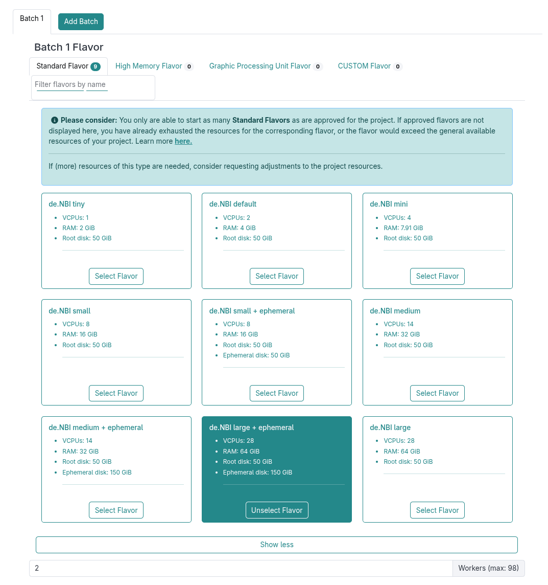

## Section 5 (Part 1): Scale up your analysis horizontally 

In this part of the tutorial, you will learn how to scale up your cluster horizontally using a SimpleVM Cluster.
A SimpleVM cluster comprises a master node and multiple worker nodes. A SLURM workload manager
will be installed. SLURM allows you to submit scripts, known as jobs, which are queued up.
When free resources (CPUs, RAM) become available on one of the worker nodes, the script will be executed on that node.
This means that you do not have to check which nodes are free in order to run your jobs.
Next, you will configure a cluster and submit your tools to a SLURM job scheduler.

### 5.1 Create a Cluster

1. Click on "Create new Clusters" on the left menu.

2. Since your master node is just used for submitting jobs, please select *de.NBI medium* as flavor and
   the snapshot **SimpleVMGCB2025-7a849** as image.
   
3. The worker nodes will run the actual tools, so we need a flavor with more cores then the one
   that the master node is using. Furthermore, the worker nodes need more disk space since the tools save their intermediate results on the respective worker node. 
   That's why we have to select a flavor with an Ephemeral disk. Please select **de.NBI large + ephemeral** as flavor and start
   two worker nodes by providing `2` as the worker count.
   

4. Every cluster has a shared disk between all worker nodes and the master node. You can create a new volume for the cluster with 300 GB size. 
   Don't forget to click on **Add Volume**.

5. Grant access to the workshop organizers.
   This way the organizers get ssh access to your VM and can help you in case
   something does not work as expected.
   

6. You've just started your own cluster with a few clicks.

Back to [Section 4](part4.md) | Next to [Section 5 (Part 2)](part52.md)
