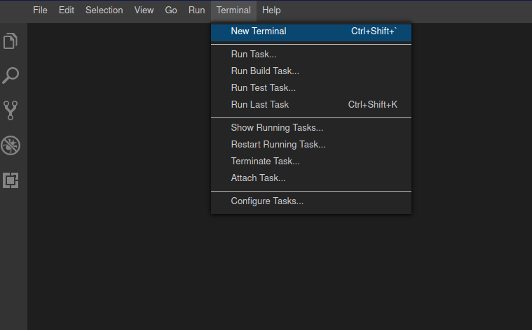

## Section 5 (Part 2): Scale up your analysis horizontally to further analyze the detected Microbiomes


In the previous part you found datasets that contains the **Staphylococcus Aureus** and the **Enterococcus faecium** strain. 
In the second part of section 5 you will investigate your cluster setup and use the infrastructure
for your computations. We want now to try to assemble the metagenome and try to bin the strain in order to analyze the genes.

### 5.2 Investigate your cluster setup

1. Click on the Clusters tab. After you have initiated the start-up of the cluster,
   you should have been automatically redirected there. Now click on the cluster to open the dropdown.
   Click on the Theia IDE URL which opens a new browser tab.

2. Click on `Terminal` in the upper menu and select `New Terminal`.
   

3. Check how many nodes  are part of your cluster by using `sinfo`. 

```
sinfo  --Node -o "%N %m %c %S %t"
```
which will produce the following example output
```
NODELIST MEMORY CPUS ALLOCNODES STATE
bibigrid-master-537z5g36abymq8w 64075 28 all drain
bibigrid-worker-537z5g36abymq8w-0 64075 28 all idle
bibigrid-worker-537z5g36abymq8w-1 64075 28 all idle
```
You can also see the number of **CPUS** and the amount of RAM (**MEMORY**) assigned.
Another important columns here are `STATE` which tells you if the worker nodes are processing jobs
or are just in `idle` state and the column `NODELIST` which is just a list of nodes.

4. You could now submit a job and test if your cluster is working as expected.
   **/vol/spool** is the folder which is shared between all nodes. You should always submit jobs
   from that directory.
   ```
   cd /vol/spool
   ```

5. Please fetch the script that we want to execute
   ```
   wget https://openstack.cebitec.uni-bielefeld.de:8080/simplevm-workshop/basic.sh
   ```
   The script contains the following content:
   ```
   #!/bin/bash
   
   #Do not do anything for 30 seconds 
   sleep 30
   #Print out the name of the machine where the job was executed
   hostname
   ```
   where
    * `sleep 30` will delay the process for 30 seconds.
    * `hostname` reports the name of the worker node.

6. You could now submit the job to the SLURM scheduler by using `sbatch` and directly after that
   check if SLURM is executing your script with `squeue`.

   sbatch:
   ```
   sbatch basic.sh
   ```
   
   squeue:
   ```
   squeue
   ```
   which will produce the following example output:
   ```
   JOBID PARTITION     NAME       USER    ST      TIME  NODES NODELIST(REASON)
   1     openstack     basic.sh   ubuntu  R       0:04      1 bibigrid-worker-537z5g36abymq8w-0
   ```
   Squeue tells you the state of your jobs and which nodes are actually executing them.
   In this example you should see that `bibigrid-worker-1-1-us6t5hdtlklq7h9` is running (`ST` column) your job
   with the name `basic.sh`.

7. Once the job has finished you should see a slurm output file in your directory (Example: `slurm-212.out`)
   which will contain the name of the worker node which executed your script.
   Open the file with the following command:
   ```
   cat slurm-*.out
   ```
   Example output:
   ```
   bibigrid-worker-537z5g36abymq8w-0
   ```

8. One way to distribute jobs is to use so-called array jobs. With array jobs you specify how many times
   your script should be executed. Every time the script is executed, a number between 1 and the number of times
   you want the script to be executed is assigned to the script execution. The specific number is saved in a
   variable (`SLURM_ARRAY_TASK_ID`). If you specify `--array=1-100` then your script is 100 times executed and
   the `SLURM_ARRAY_TASK_ID` variable will get a value between 1 and 100. SLURM will distribute the
   jobs on your cluster.

   Please fetch the modified script
   ```
   wget https://openstack.cebitec.uni-bielefeld.de:8080/simplevm-workshop/basic_array.sh
   ```

   Which is simply reading out the `SLURM_ARRAY_TASK_ID` variable and placing them in a file in an
   output directory:

   ```
   #!/bin/bash
   
   # Create output directory in case it was not created so far
   mkdir -p output_array
   
   #Do not do anything for 10 seconds 
   sleep 10
   
   #Create a file with the name of SLURM_ARRAY_TASK_ID content. 
   touch output_array/${SLURM_ARRAY_TASK_ID}
   ```
 
   You can execute this script a 100 times with the following command 
   ```
   sbatch --array=1-100 basic_array.sh
   ```
   
   If you now check the `output_array` folder, you should see numbers from 0 to 100.
   ```
   ls output_array
   ```

### 4.1 Prepare the Metagenomics-Toolkit run  

The Metagenomics-Toolkit will run the steps quality control, assembly, binnning and classification.
Internally is the Metagenomics-Toolkit workflow a Nextflow based workflow and Nextflow is also using commands like sbatch behind the scenes. 
Especially for the classification part we need a lot of storage in order to store the database.

3. Create database directory

   ```
   mkdir /vol/spool/database
   ```

4. Download GTDB from our S3 storage using minio again. 

   ```
   mc cp --recursive sra/databases/gtdbtk_r226_v2_data/ /vol/spool/release226
   ```

5. Install Java 

   ```
   sudo apt install -y unzip default-jre 
   ```

6. Install Nextflow

   ```
   curl -s https://get.nextflow.io | bash
   ```

6. Move it to a folder where other binaries usually are stored:
   ```
   sudo mv mc /usr/local/bin/
   ```

7. Change file permissions:
   ```
   chmod a+x /usr/local/bin/nextflow
   ```

8. We need to tell the Toolkit how to access the data stored in S3

```
cat > /vol/spool/aws.config <<EOF
aws {
  client {
      s3PathStyleAccess = true
      connectionTimeout = 120000
      maxParallelTransfers = 28
      maxErrorRetry = 10
      protocol = 'HTTPS'
      connectionTimeout = '2000'
      endpoint = 'https://s3-int.bi.denbi.de'
      signerOverride = 'AWSS3V4SignerType'
    }
   }
EOF 
```

### 4.2 Run the Toolkit

1. Go to the shared directory:
   ```
   cd /vol/spool
   ```

2. Create a file listing the SRA run ids you want to process: 
   ```
   echo -e "ACCESSION\nSRR492065\nERR3277263" > sra.tsv 
   ```
   
2. Run the Toolkit 
   ```
   NXF_HOME=$PWD/.nextflow NXF_VER=25.04.2 nextflow run metagenomics/metagenomics-tk \
        -r 0.13.2 \
        -c /vol/spool/aws.config \
        -ansi-log false \
        -profile slurm -resume -entry wFullPipeline \
        -work-dir work \
        -params-file https://raw.githubusercontent.com/SimpleVM/simpleVMWorkshopGCB/refs/heads/main/config/fullPipeline_illumina_nanpore.yml \
        --databases=/vol/databases/ \
        --input.SRA.S3.path=/vol/spool/sra.tsv --output=output
   ``` 

   <details><summary>Show Explanation</summary>
   </details>

3. In a second terminal you can check the progress using **squeue**
   ```
   squeue --format="%.18i %.90j %t %.6C %m %.10M %N"
   ```

# Todo: Explain what to check regarding output

### 4.3 Explain the results

   Inspect the GTDB-tk results
   You can open the GTDB-Tk output:
   ```
   ls output/SRR492065/1/magAttributes/4.0.0/gtdb/SRR492065_gtdbtk_generated_combined.tsv   
   ```

   In column two there is a Staphylococcus Aureus genome.

Back to [Section 5 (Part 1)](part51.md)
